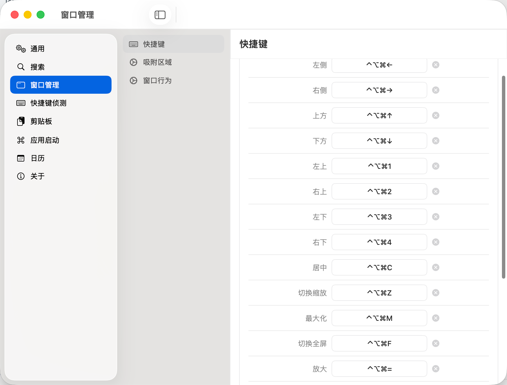
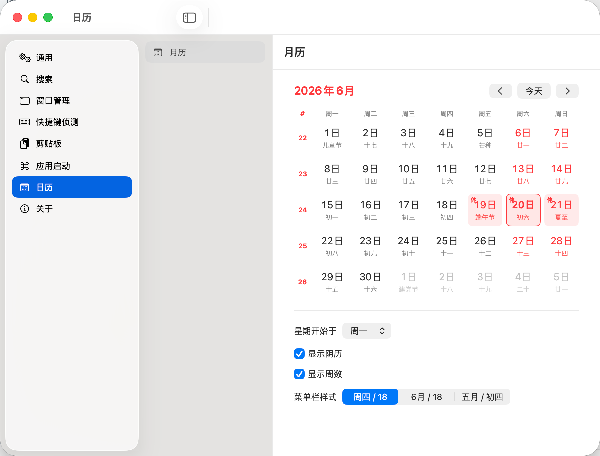
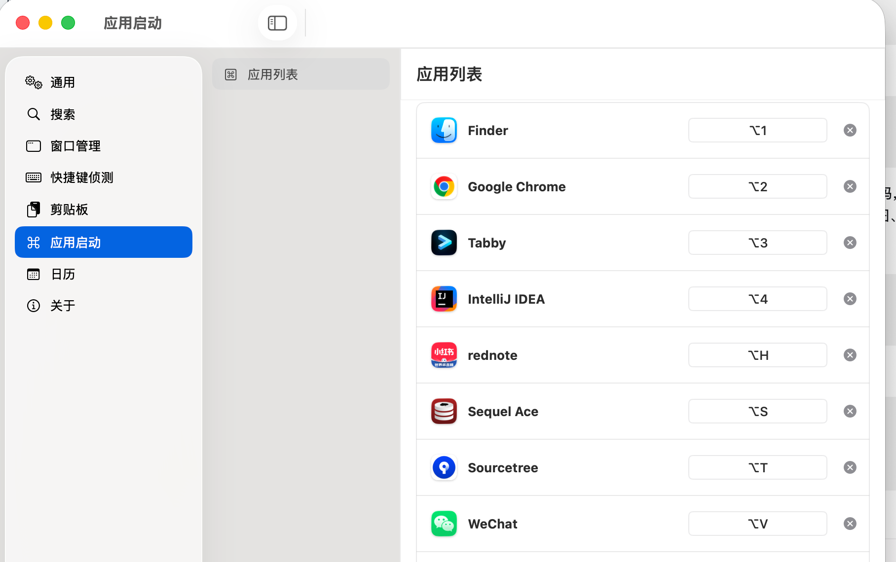

# xxMac

简体中文 | [English](README.md)

xxMac 是一个安装包约 2 MB 的轻量级 macOS 原生状态栏效率工具，基于 `SwiftUI + AppKit` 构建，支持窗口管理、全局快捷键、启动器、中国日历、快捷键冲突定位、剪贴板历史与常用工作流。它把日常高频操作整合到一个轻量入口里，日常使用形态是：

1. 右上角状态栏入口（默认显示，可在“通用 > 配置”里关闭或重新开启）。
2. 全局热键唤起的浮动启动器面板。
3. 双击打开 App 时显示三栏结构的设置窗口，窗口支持拉伸并可拖拽调整栏目宽度。

## 产品截图

<table>
  <tr>
    <td width="25%" align="center"><br>1</td>
    <td width="25%" align="center"><br>2</td>
    <td width="25%" align="center"><br>3</td>
    <td width="25%" align="center"><br>4</td>
  </tr>
</table>

## 功能概览

| 能力 | 说明 | 类似/替代 |
| --- | --- | --- |
| 启动器 | 通过全局热键打开半透明浮层，搜索应用、执行窗口命令、选择剪贴板历史；支持最近操作历史、键盘翻页选择、自定义底色、透明度、内容大小和窗口宽高。 | Alfred / Spotlight |
| 启动器计算器 | 在启动器搜索栏直接输入 `4+8`、`(2+3)*4`、`-3.5/2` 等四则运算表达式，实时显示计算结果，回车复制结果。 | Alfred Calculator / Spotlight |
| 应用快捷启动 | 为指定 App 绑定独立热键，支持启动、激活、隐藏切换。 | Thor |
| 窗口管理 | 快捷操作窗口左右半屏、上下半屏、四角、居中、最大化、缩放、跨屏移动等。需要在“系统设置 > 隐私与安全性 > 辅助功能”中授权；重新打包或移动 App 后，需要删除旧 App 授权并重新添加当前 App。 | ShiftIt |
| Finder 路径粘贴 | 在 Finder 里复制文件或文件夹后，按 `Command + Shift + V` 可向前台应用粘贴完整路径，适合终端、编辑器、聊天窗口等场景。 | Copy Path / Path Finder |
| 中国日历 | 提供右上角状态栏入口，支持中国农历、节假日、节气、周数和状态栏图标样式配置。 | CalendarX |
| 快捷键捕捉 | 记录快捷键被哪个 App 接收，用于定位快捷键冲突。 | Shortcut Detective |
| 剪贴板历史 [默认关闭]| 记录文本和图片剪贴板，使用 SQLite 持久化，支持检索、预览和回贴；大文本预览只显示前一部分但回贴保留完整内容；图片项会显示宽高和大小，超过阈值时生成缩略图用于预览；可选启用本地 OCR，把图片文字作为 metadata 写入数据库用于搜索。可通过自定义全局热键或菜单栏“剪贴板历史”打开，密码输入框等安全输入场景下会使用高层级浮层显示。 | 剪贴板管理器 |
| Snippets | 类似 Alfred Snippets，支持分类、条目、关键词搜索；全局热键唤起搜索面板，左侧选择条目、右侧预览内容，回车后直接向前台应用输入片段内容，并同步复制到系统剪贴板。 | Alfred Snippets |
| 快捷指令搜索 | 在启动器里用关键词触发网页搜索，例如输入自定义关键词后跟搜索词即可打开 Google、Baidu 或任意 URL 模板；也可勾选为始终显示在启动器候选中。 | Alfred Web Search |
| 快捷指令脚本 | 在启动器里用关键词执行本地命令脚本，支持无参、`{query}` 单参数和 `argv` 多参数模式，可把复杂脚本放在配置目录的 `quick/` 下复用。 | Alfred Workflows |
| 浏览器搜索 | 在启动器中用 `bm` 搜索当前 Chrome/Edge Profile 的书签，用 `bh` 搜索历史记录；浏览器和两个关键词均可在“搜索 > 浏览器搜索”配置。 | Alfred Browser Bookmarks |
| LockJob | 一键遮住所有屏幕并阻止系统睡眠，Claude、Codex、构建、下载和 SSH 会话继续运行；显示时间和自定义状态文字，支持 Touch ID 或本机密码解锁。 | 锁屏遮罩 |
| 多语言 | 已有简体中文、繁体中文、英文资源结构。 | - |

## 默认快捷键

| 快捷键 | 动作 |
| --- | --- |
| `Control + Option + Space` | 打开或关闭启动器 |
| `Control + Option + Command + ←/→/↑/↓` | 当前窗口左右/上下半屏 |
| `Control + Option + Command + 1/2/3/4` | 当前窗口移动到四角 |
| `Control + Option + Command + C` | 当前窗口居中 |
| `Control + Option + Command + M` | 当前窗口最大化 |
| `Control + Option + Command + F` | 切换全屏 |
| `Control + Option + Command + =/-` | 放大或缩小窗口 |
| `Control + Option + Command + N/P` | 移动到下一块/上一块屏幕 |
| `Control + Option + Command + L` | LockJob：遮住屏幕并保持运行 |
| `Control + Option + Command + X` | 打开 Snippets 搜索 |
| `Command + Shift + V` | 将 Finder 中复制的文件/文件夹粘贴为完整路径 |

这些快捷键都可以在设置窗口里调整。xxMac 会统一检查窗口管理、通用、应用启动、剪贴板和 Snippets 的快捷键，拒绝保存应用内部的重复组合；启动器文本关键词在独立的命名空间中检查冲突。

启动器搜索到应用后，可用 `↑/↓` 或 `Page Up/Page Down` 选择结果，直接按 `Return` 打开应用；输入 `4+8`、`(2+3)*4` 等四则运算表达式时会显示计算结果，按 `Return` 复制结果；按住 `Command` 时选中行会显示 `Reveal in Finder`，此时按 `Return` 会在 Finder 中定位该应用文件。启动器会记录最近执行的应用、窗口命令、快捷指令和计算器结果，默认最多 100 条，可在“搜索 > 通用”调整或清空；空查询时默认显示配置为“始终显示在启动器候选中”的快捷指令，直接按方向键会切换到最近操作历史，剪贴板历史和 Snippets 不会写入该记录。

浏览器搜索首次根据 macOS 默认浏览器选择 Chrome 或 Microsoft Edge，之后可在设置中手动覆盖。xxMac 读取浏览器 `Local State` 中最近使用的 Profile；首版不合并或提供 Profile 选择。默认输入 `bm 关键词` 搜索书签、`bh 关键词` 搜索历史，只输入 `bm` 或 `bh` 可查看候选；两个关键词都可以自定义，并且不能彼此重复或与已启用的快捷指令重复。回车始终使用设置中选择的浏览器打开结果。

## 快速开始

前置要求：

1. macOS 13 或更新版本。
2. Xcode Command Line Tools 或 Xcode。
3. Swift 5.9 兼容工具链。

开发运行：

```bash
swift build
swift run xxMac
```

打包为 `.app`：

```bash
bash bundle_app.sh
open xxMac.app
```

发布为 `.dmg`：

```bash
bash publish_dmg.sh
```

发布脚本会先打印 `Sources/xxMac/Info.plist` 中记录的当前版本号，并提示输入本次发布版本。版本会写回 `CFBundleShortVersionString` 和 `CFBundleVersion`，最近更新时间会写回 `XXLastUpdated`，生成的 DMG 默认命名为 `xxMac-版本号.dmg`。

`bundle_app.sh` 和 `publish_dmg.sh` 默认使用固定签名身份 `qbmiller-dev`，不允许退回 ad-hoc 签名。这样可以让 macOS 辅助功能权限尽量绑定到稳定的 App 身份，减少重新打包后需要删除旧授权并重新添加的情况。需要临时换证书时，可以通过 `SIGNING_IDENTITY` 环境变量覆盖。

如果没有开发者账号，App 拷贝到 `/Applications` 后可能会被 macOS 标记为隔离来源，导致打不开。可以先清理隔离属性再启动：

```bash
xattr -cr /Applications/xxMac.app
open /Applications/xxMac.app
```

如果要使用开发者证书签名：

```bash
SIGNING_IDENTITY="Apple Development: Your Name (TEAMID)" bash bundle_app.sh
```

## 系统权限

首次运行后，需要在“系统设置 > 隐私与安全性”里授予权限：

1. 辅助功能权限：窗口管理、全局热键、模拟粘贴依赖它。
2. 自动化权限：应用激活、重开窗口和剪贴板回贴链路可能用到。

可在 xxMac 的“通用 > 权限设置”中查看辅助功能授权状态，并点击“获取辅助功能权限”打开 macOS 对应授权入口。

如果窗口控制、全局热键或剪贴板回贴在重新打包后失效，优先检查系统“辅助功能”列表里授权的是否是当前路径下的 `xxMac.app`，并确认发布包使用同一个 `SIGNING_IDENTITY` 签名。macOS 的辅助功能授权会受 App 路径和签名状态影响，重新打包或移动 App 后可能需要删除旧授权并重新添加。

## 配置与数据

- 默认配置目录是 `~/Library/Application Support/xxMac`，可在“通用 > 配置”里修改。修改后会把当前配置、应用索引缓存、剪贴板 SQLite 数据库和图片缓存迁移到新目录，并删除旧目录中的 xxMac 数据。
- 右上角状态栏入口默认显示；如果图标异常消失，或希望隐藏状态栏入口，可在“通用 > 配置”里切换“显示在右上角状态栏”。该区域提供状态栏诊断信息和“刷新/重建”按钮，用于确认 `NSStatusItem` 是否已创建、可见并挂载到系统状态栏。
- 配置目录可以是本地目录，也可以是 iCloud Drive、Dropbox 等同步服务下保持本地可用的目录；不建议选择系统目录、App 包内目录或临时移动磁盘路径。
- 热键配置、应用快捷启动配置、启动器窗口宽高、整体大小、文字大小与外观、启动器最近操作历史、语言偏好、快捷指令、浏览器搜索、Snippets 和日历偏好保存在配置目录的 `preferences.json`。启动器最近操作历史只记录应用、窗口命令、快捷指令和计算器结果的元数据，不记录剪贴板历史或 Snippets 内容；默认最多保留 100 条，可在“搜索 > 通用”配置。日历偏好包含状态栏显示方式，默认使用日历图标，也可切换为 App 图标。首次启动默认值集中在 `Sources/xxMac/AppDefaultSettings.swift`，该文件可用注释说明默认开关。
- 配置目录下会自动创建 `quick/`，用于放置复杂快捷指令脚本。命令脚本执行时会注入 `XXMAC_HOME`（配置目录）和 `XXMAC_QUICK_HOME`（`quick/` 目录），例如 `python "$XXMAC_QUICK_HOME/xxx/a.py" {query}`。网页搜索快捷指令会把站点图标缓存到 `quick_icons/`，用于设置列表和启动器候选展示；删除快捷指令或修改为其他站点时会清理对应图标缓存。
- 应用搜索默认覆盖 `/Applications`、`/System/Applications`、`/System/Library/CoreServices`，也支持在设置里添加自定义搜索路径；重建索引时优先复用 macOS Spotlight 发现应用，Spotlight 不可用或没有返回可用结果时自动回退到目录扫描。应用索引缓存保存在配置目录的 `app-search-index.json`。把新 App 拖入这些搜索目录后会自动追加到现有索引，不会重建整个索引；也可在“通用 > 配置”里手动点击“索引应用”重建。中文应用名会同时写入原文、全拼和拼音首字母索引；英文应用名也会写入单词首字母索引。
- 浏览器书签和历史数据库保持在 Chrome/Edge 自己的目录中，xxMac 仅在本机只读访问。历史搜索会在系统临时目录创建唯一副本并在查询结束后立即删除；这些数据不会写入、导出或随迁移进入 xxMac 配置目录。
- 剪贴板数据库、图片原图缓存与图片缩略图缓存位于配置目录的 `clipboard.db`、`clipboard_images/` 和 `clipboard_thumbnails/`。
- 剪贴板历史会记录系统剪贴板中出现的所有非空文本；如果浏览器或密码管理器允许把密码复制到系统剪贴板，也会被记录。若网页或应用没有真正写入系统剪贴板，则 xxMac 无法采集。
- “导出配置”只导出可配置设置，不导出剪贴板历史记录、SQLite 数据库、图片缓存、缩略图缓存、快捷指令站点图标缓存或应用索引缓存；完整迁移请使用配置目录切换。
- “通用 > 配置”底部提供退出应用按钮，退出前会二次确认。
- 剪贴板历史最多保留条数和图片缓存总量可在“剪贴板通用”中配置，默认分别为 1000 条和 500 MB。
- 图片超过“生成缩略图”阈值时才会创建缩略图，默认阈值为 5 MB，可在“剪贴板通用”中调整。
- 图片 OCR 默认关闭；启用后使用 macOS Vision 在本机识别图片文字，不上传图片。OCR 文本存入 `clipboard.db` 作为图片 metadata，用于剪贴板搜索；“导出配置”不导出 OCR 历史 metadata。
- 设置窗口第一列是工具分类，第二列是功能项，第三列是具体配置。

## 目录结构

```text
xxMac/
├── Package.swift
├── README.md
├── README_zh-CN.md
├── PACKAGING_GUIDE.md
├── bundle_app.sh
├── publish_dmg.sh
├── Resources/
│   ├── AppIcon.icns
│   ├── *.lproj/
│   └── calendar_*.json
├── Sources/xxMac/
│   ├── xxMac.swift
│   ├── Managers/
│   ├── Models/
│   ├── ViewModels/
│   └── Views/
└── docs/
    ├── images/
    └── ARCHITECTURE.md
```

## 常用命令

```bash
swift build
swift run xxMac
bash bundle_app.sh
bash publish_dmg.sh
VERSION=0.0.1 bash publish_dmg.sh
xattr -cr /Applications/xxMac.app
log stream --style compact --predicate 'process == "xxMac"'
codesign -v xxMac.app
```

## 文档

- `docs/ARCHITECTURE.md`：项目架构、模块职责、运行流程、数据配置和后续任务地图。
- `docs/secure-input-overlay.md`：密码输入框等安全输入场景下剪贴板历史和 Snippets 浮层唤起方案。
- `PACKAGING_GUIDE.md`：打包、签名、权限、日志和快捷键排障。
